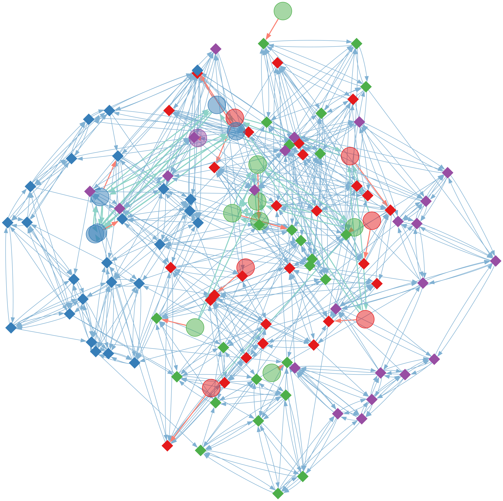
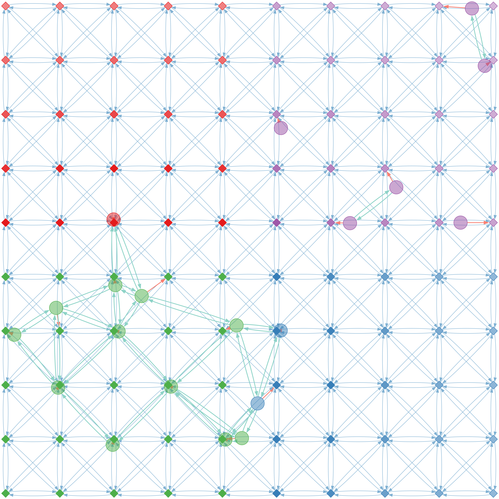

# :alembic: FPMAS MetaModel

The purpose of the _MetaModel_ is to provide a test bench to estimate load
balancing and synchronization modes performances provided by
[FPMAS](https://github.com/FPMAS/FPMAS) on different kinds of models, easily
generated from a few configuration fields in a YAML file.

Several types of base graphs are provided by FPMAS:
- Grids
- Uniform random graphs
- Clustered graphs
- Small-World networks

Those graphs can easily be configured with a provided node count and an average
outgoing neighbors count. Each graph can then be used to define a pure graph
model, or as a spatial environment on which agents are randomly moving.

Agents can move uniformly, or according to an utility value assigned to each
cell, in order to define spatial models with a non-uniform agent distribution,
notably to test the behavior of each load balancing algorithm in this case.

## Build

Ensures that the [FPMAS](https://github.com/FPMAS/FPMAS) platform is properly
installed. An additional `-DCMAKE_PREFIX_PATH=custom/installation/path/` might
be specified to `cmake` if `FPMAS` is not installed in a standard directory
(the installation path corresponds to the `-DCMAKE_INSTALL_PREFIX` eventually
specified when building `FPMAS`).

```
git clone https://github.com/FPMAS/fpmas-metamodel
cd fpmas-metamodel
mkdir build
cd build
cmake -DCMAKE_BUILD_TYPE=Release ..
make
```

## Configuration

The _MetaModel_ can easily be configured with many parameters in order to
generate many kinds of models.

See the documented [config.yml](blob/master/config.yml) file, the [documentation of the config.h](https://fpmas.github.io/fpmas-metamodel/config_8h.html) file,
the [_MetaModel_ doxygen documentation](https://fpmas.github.io/fpmas-metamodel/)
and the [FPMAS wiki](https://github.com/FPMAS/FPMAS/wiki) for more information
about the _MetaModel_ configuration fields.

Useless fields can be safely removed from the YML configuration file, so that
the default value specified in the original `config.yml` configuration file is
used. Some basic examples are provided in the `examples` directory.

## Run

The model can be run with the following command:

```
mpiexec -n <N> ./fpmas-metamodel <config_file> [-s seed]
```
- `N`: processes count
- `config_file`: a `.yml` configuration file
- `seed` (optional): a random seed

The `./gen-seed N` utility command can also be used to deterministically
generate a set of `N` seeds that can be passed to the model.

## Output

The _MetaModel_ can generate several (and complex outputs).

### CSV

The main and default _MetaModel_ output consists in one CSV file by test case
and by process, named `<lb_algorithm>-<lb_period>.<process_rank>.csv`, with the
following fields. See the [MetaModelCsvOutput class documentation](https://fpmas.github.io/fpmas-metamodel/classMetaModelCsvOutput.html)
for the description of each field.

The external analysis of the output data is a complex project on its own, that
is not detailed here and not handled within this project.

### JSON

The `json_output` and the `json_output_period` parameters can be used to
generate some JSON outputs in order to perform external visualisation. The JSON
output is currently only supported for GRID based environment.

When enabled, several `.json` files are produced:
- `<lb_algorithm>-<lb_period>_cells.<time_step>.json`: see
  [CellsLocationOutput](https://fpmas.github.io/fpmas-metamodel/classCellsLocationOutput.html)
- `<lb_algorithm>-<lb_period>_agents.<time_step>.json`: see
  [AgentsOutput](https://fpmas.github.io/fpmas-metamodel/classAgentsOutput.html)

### DOT

Finally, a [DOT](https://graphviz.org/doc/info/lang.html) can be produced at the
end of the simulation in the file `<lb_algorithm>-<lb_period>.<time_step>.dot`,
that can be rendered externally using the
[Graphviz](https://graphviz.org/docs/layouts/) tools. The size of the output can
grow very fast as the size of the models grows, so such output is only relevant
for relatively small models.

Examples of DOT rendering with the `fdp` tool for example configurations in
`examples/dot` are presented below. See the `graphviz` manual pages to configure
the rendering tools, or directly modify the generated `.dot` files.

| small_world.yml | grid.yml |
|-----------------|----------|
|  |  |

- Diamonds represent `Cells`
- Circles represent `Agents`
- The opacity of `Cells` is proportionnal to their utility
- Blue links represent the `Cell` network
- Red links represent location links
- Green links represent interactions

With the `grid.yml` configuration, that defines a `grid_attractor` at `(2, 2)`,
we can see that agent gather around those coordinates. It is the purpose of the
_MetaModel_ to easily produce those mechanics so the behavior of load balancing
algorithms can be studied.

## Graph stats

The `fpmas-metamodel-graph-stats` tool can be used to easily generate different
environment to dump them to DOT files and to compute some graph statistics such
as the average shortest path length, clustering coefficient, centrality or size
of the biggest connected components.

```
mpiexec -n <N> ./fpmas-metamodel-graph-stats -i -s <seed> <graph_stats_config.yml>
```
- `N`: processes count
- `graph_stats_config`: a `.yml` configuration file. See [graph_stats_config.yml](blob/master/graph_stats_config.yml) for a simple example.
- `seed` (optional): a random seed that can be used to generate different graphs
  with the same FPMAS graph generators configuration.
- `-i`: if specified, only the initialisation and the DOT output of each graph
  is performed, without requiring FPMAS to output graph statistics.

Currently, FPMAS features about graph statistics are relatively experimental, so
we recommend to use the `-i` option. The excellent Python
[graph-tool](https://graph-tool.skewed.de/) can be used instead to compute many
statistics from the generated DOT files.

## Contact

For more information about this model or its implementation, please contact:
- Paul Breugnot (developer): paul.breugnot@univ-fcomte.fr
- Laurent Philippe (supervisor): laurent.philippe@univ-fcomte.fr
- Bénédicte Herrmann (supervisor): benedicte.herrmann@univ-fcomte.fr
- Christophe Lang (supervisor): christophe.lang@univ-fcomte.fr
